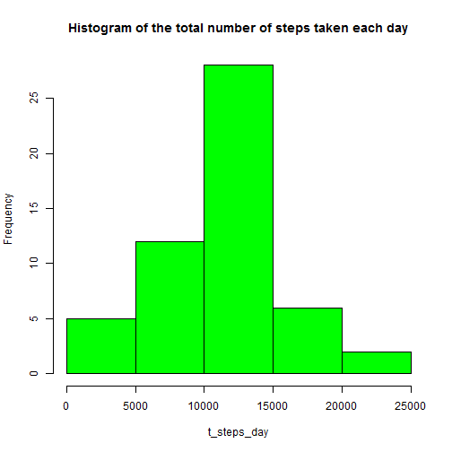
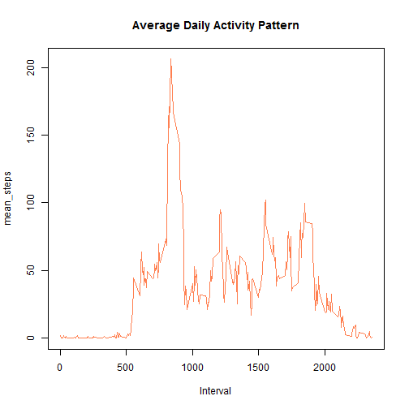
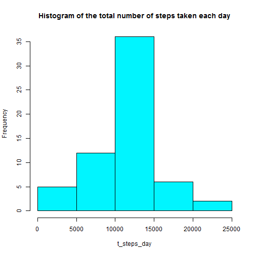
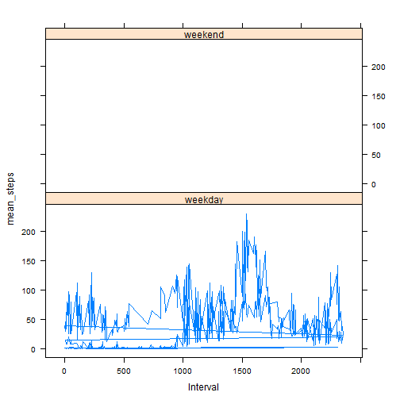

title:   Reproducible Research: Peer Assessment 1
output: html_document
keep_md: true


# Loading and preprocessing the data

```r
data <- read.csv("activity.csv", sep = ",", na.strings=c("NA"))
# Treats the NA data.
data1<-data[!is.na(data$steps),]
```


# What is mean total number of steps taken per day?

```r
# Calculates the total number of steps taken per day
t_steps_day <- tapply(X=data$steps,INDEX=data$date,FUN=sum, na.RM=TRUE)

# Histogram of the total number of steps taken each day
hist(t_steps_day, col = "green", 
     main = "Histogram of the total number of steps taken each day")
```

 

```r
# Calculate and report the mean and median of the total number of steps taken per day
mean(t_steps_day, na.rm = TRUE)
```

```
## [1] 10767.19
```

```r
median(t_steps_day, na.rm = TRUE)
```

```
## [1] 10766
```


# What is the average daily activity pattern?

```r
# Calculates the average per interval 
mean_steps <- tapply(X=data1$steps,INDEX=data1$interval,FUN=mean, na.RM=TRUE)

# Creates the Graphic.
plot(rownames(mean_steps), mean_steps, type="l", 
     main = "Average Daily Activity Pattern" ,xlab = "Interval",  
     col = "coral")
```

 

```r
# Which 5-minute interval, on average across all the days in the dataset, contains the maximum number of steps?
max(mean_steps)
```

```
## [1] 206.1698
```

```r
mean_steps[104]
```

```
##      835 
## 206.1698
```

# Imputing missing values

```r
# Calculate the total number of missing values in the dataset
data_missing <- data[is.na(data$steps),]
nrow(data_missing)
```

```
## [1] 2304
```

```r
# Row names of mean_steps
rowname<-rownames(mean_steps)

# For each interval...
for (i in 1:288) {

  #Filter the interval = 0, 5, 10, etc. one by one and replace the steps to the respectively mean value.
  data_missing[data_missing$interval==rowname[i],][1] <- mean_steps[i] 
    
}

# Merge the datasets.
new_data <- merge(data1,data_missing, all=TRUE)

# Calculates the total number of steps taken per day
t_steps_day <- tapply(X=new_data$steps,INDEX=new_data$date,FUN=sum)

# Histogram of the total number of steps taken each day
hist(t_steps_day, col = "turquoise1", 
     main = "Histogram of the total number of steps taken each day")
```

 

```r
# Calculate and report the mean and median of the total number of steps taken per day
mean(t_steps_day)
```

```
## [1] 10766.19
```

```r
median(t_steps_day)
```

```
## [1] 10766.19
```

# Are there differences in activity patterns between weekdays and weekends?

```r
day <- weekdays(as.Date(new_data$date, format = "%Y-%m-%d"))
#day <- weekdays(strptime(new_data$date, format = "%Y-%m-%d"))
dayofweek <- ifelse(day %in% c("Saturday", "Sunday"), "weekend", "weekday")

library(datasets)
library(lattice)

## Convert 'dayofweek' to a factor variable
new_data <- transform(new_data, dayofweek = factor(dayofweek))

#Calculates the average per interval 
mean_steps <- tapply(X=new_data$steps,INDEX=list(new_data$dayofweek, new_data$interval),FUN=mean)

#Panel plot   ******** I could not fix the issue with the "weekend *********
xyplot(mean_steps ~ new_data$interval | dayofweek, data = new_data, layout = c(1, 2), xlab = "Interval", type = "l")
```

 


